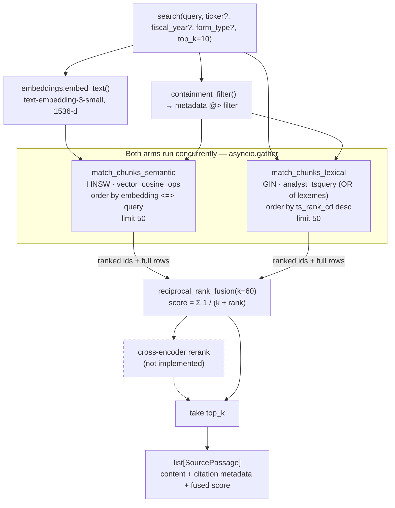

# Retrieval

Hybrid search over the ingested SEC filing corpus: a question goes in, ranked
`SourcePassage` objects come out. This package owns the entire ranking policy —
the database returns two independent rankings and knows nothing about how they
combine, and the agent (Phase 6) consumes passages without knowing how they
were found.

| File | Responsibility |
| --- | --- |
| [retriever.py](retriever.py) | `DocumentRetriever`, `SourcePassage`, filter construction, row → passage mapping |
| [fusion.py](fusion.py) | Reciprocal Rank Fusion — combines the two ranked lists |
| [queries.py](queries.py) | The four database reads (two RPCs, two PostgREST table reads) |

The SQL behind the two ranked searches lives in the
[`eb1fd84894ef` migration](../../alembic/versions/2026_08_18_0700-eb1fd84894ef_retrieval_search_functions.py),
not here.

## How the pipeline works



Step by step:

1. **Filters are built first.** `ticker`, `fiscal_year` and `form_type` become a
   JSONB object applied as containment (`metadata @> filter`) inside both SQL
   functions, so filtering happens *before* ranking rather than after. An empty
   object contains everything, so "no filter" needs no special case.
2. **The query is embedded** with the same model and width as the corpus —
   `app/embeddings.py` is shared with ingestion precisely so the query vector
   lands in the same space.
3. **Both arms run concurrently** via `asyncio.gather`, each returning up to 50
   full rows. Semantic ranks by cosine similarity; lexical ranks by
   `ts_rank_cd` over an OR-ed tsquery.
4. **Fusion reads ranks, not scores.** Cosine similarity is bounded in `[0, 1]`
   and clusters near 0.8; `ts_rank_cd` is unbounded and frequency-dependent.
   Averaging them compares quantities on different scales, so RRF throws the
   scores away and fuses positions instead.
5. **The top `top_k` are returned.** Both arms already returned full rows, so
   the winners are hydrated from an in-memory dict — no second round trip.

`read_chunk` and `read_surrounding_chunks` bypass the pipeline entirely; they
are ordinary PostgREST reads by id and by `(document_id, chunk_index)` range.

### Degradation, on purpose

- A query of nothing but stopwords produces no lexemes, `@@ NULL` matches
  nothing, and fusion rides on the semantic arm alone.
- A chunk found by only one arm still places — RRF has no penalty term for
  absence.
- An id the agent saw earlier can legitimately be gone (a re-ingest replaces
  chunk rows), so `read_chunk` returns `None` and `read_surrounding_chunks`
  returns `[]` rather than raising.

## Default settings

### Ranking

| Setting | Default | Where | Why |
| --- | --- | --- | --- |
| `CANDIDATE_LIMIT` | `50` | [retriever.py](retriever.py) | Per arm, before fusion. Wide enough that a chunk the semantic arm buried at rank 40 can still be rescued by the lexical arm ranking it first — the case hybrid search exists for. |
| `DEFAULT_TOP_K` | `10` | [retriever.py](retriever.py) | Returned after fusion. Ten 512-token passages ≈ 6k tokens of evidence: enough to verify a claim, small enough that the agent can afford several searches per turn. Overridable per call. |
| `RRF_K` | `60` | [fusion.py](fusion.py) | Flattens the curve so the head of one list does not dominate outright. The constant from the original 2009 RRF paper. |
| `NEIGHBOR_RADIUS` | `1` | [retriever.py](retriever.py) | One chunk either side. Chunking split on document structure, so the immediate neighbours are the rest of the same Item; going wider mostly buys the next Item, which a fresh search would find better. Overridable per call. |

### Embedding

| Setting | Default | Where |
| --- | --- | --- |
| `openai_embedding_model` | `text-embedding-3-small` | [app/config.py](../config.py) |
| `openai_embedding_dimensions` | `1536` | [app/config.py](../config.py) |
| `BATCH_SIZE` | `128` | [app/embeddings.py](../embeddings.py) |

The width is checked against `document_chunks.embedding`'s declared dimension on
every call and raises rather than writing into the wrong space. Changing it
needs a migration that rebuilds the HNSW index.

### Corpus shape (set at ingest, assumed here)

| Setting | Default | Where |
| --- | --- | --- |
| `MAX_TOKENS` (chunk target) | `512` | [ingest/chunks.py](../../ingest/chunks.py) |
| Chunker | Docling `HybridChunker`, `merge_peers=True` | [ingest/chunks.py](../../ingest/chunks.py) |
| Text search config | `english` | `search_vector` generated column |

The 512-token target is also why the lexical arm skips length normalisation:
chunks are near-uniform, so there is almost nothing for BM25's length
correction to correct.

### Database objects

| Object | Kind | Notes |
| --- | --- | --- |
| `match_chunks_semantic(vector, int, jsonb)` | `sql stable security invoker` | Returns `1 - (embedding <=> query)`, so higher is better on both arms |
| `match_chunks_lexical(text, int, jsonb)` | `sql stable security invoker` | Ranks with `ts_rank_cd` |
| `analyst_tsquery(text)` | `sql immutable` | ORs the query's lexemes — every builder Postgres ships ANDs them, which returns nothing for whole questions |
| `ix_document_chunks_embedding_hnsw` | HNSW, `vector_cosine_ops` | Only `<=>` uses it; any other operator silently seq-scans |
| `ix_document_chunks_search_vector` | GIN | Lexical arm |
| `ix_document_chunks_metadata` | GIN, `jsonb_path_ops` | Containment filters |

All reads use the **service role**: the corpus is shared reference data with no
analyst behind it, matching `database/chunks.py` and `documents.py`.

## Filters take one value each

Filters are single-valued because containment cannot express `in`. That is a
feature at the agent boundary: a question spanning five companies becomes five
searches, each with its own budget of results, instead of one search where the
loudest filer crowds out the rest.

## Deliberately not here

- **Reranking.** A cross-encoder would slot in between fusion and the `top_k`
  cut. Left out until an eval set can show it earns its latency.
- **`page`.** On the model but NULL for the whole corpus — SEC HTML has no page
  breaks. Citations identify a passage by filing and Item section instead.
- **Row shaping in `queries.py`.** Every query function returns what Postgres
  returned; `retriever.py` owns the mapping into `SourcePassage`.

## Tests

```bash
uv run pytest tests/retrieval -m "not integration"   # fakes only, no credentials
uv run pytest tests/retrieval -m integration         # live Supabase + OpenAI
```

Everything but `test_retrieval_integration.py` runs against fakes — the point of
keeping the ranking contract testable without a database or an LLM in the loop.
The integration tests are the only check that the two Postgres functions exist,
that PostgREST can see them, and that the `english` regconfig on the query side
matches the one baked into `search_vector`.
